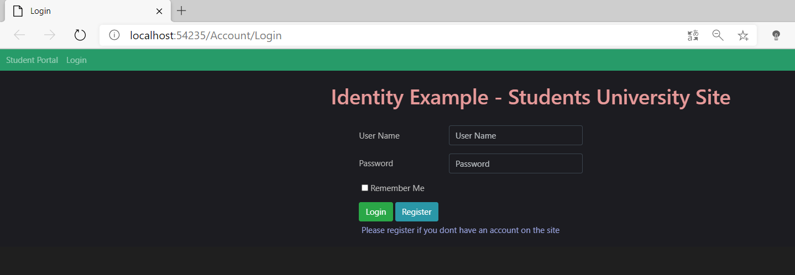

### Authentication in ASP.NET Core

Consiste en entrar a la aplicacion validando un usario y contraseña. correo y contraseña... .

Nuestra aplicación nos pide el login

Index:

Podemos crear nuestra cuenta pulsando register:

Y una vez nos validamos o creamos cuenta entra en la aplicacion:

Toda esta operativa se lleva acabo en el controlador AccountController.cs de la carpeta de Controllers.
