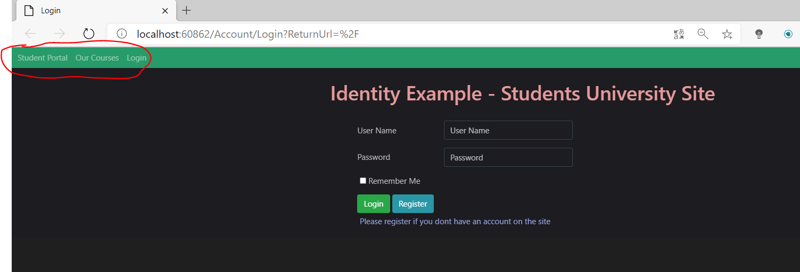
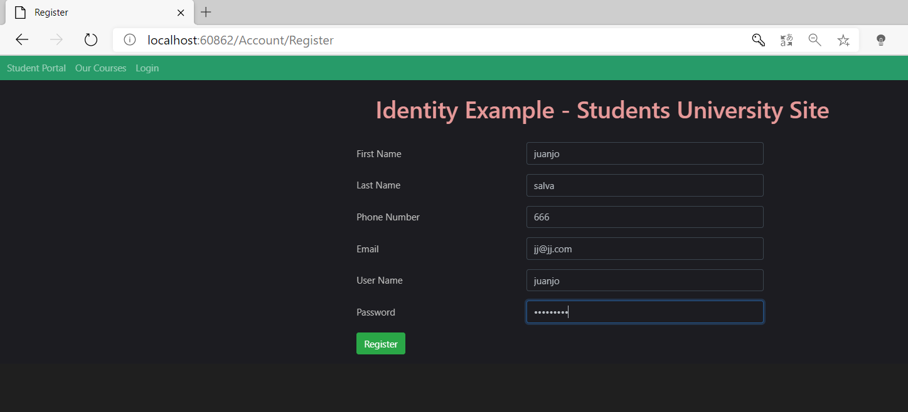
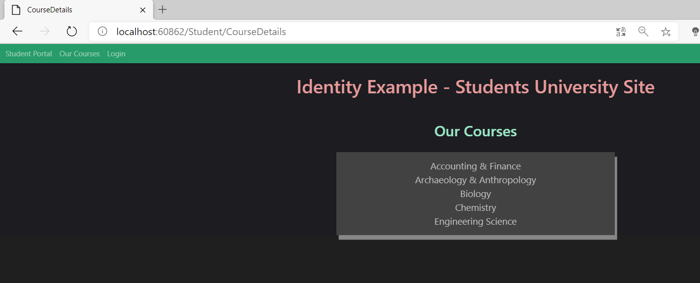
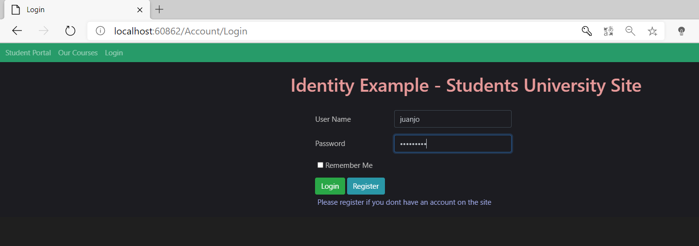
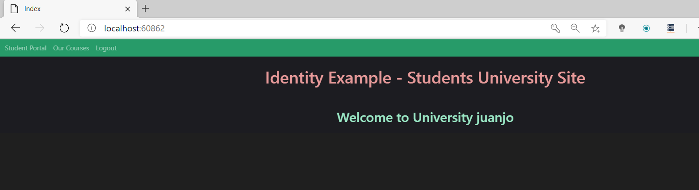

## Authorization-in-ASP.NET-Core

Una vez autenticado un usuario, la autorización consiste en dar permisos a cada usuario para ver o no unas páginas u otras o poder realizar unas u otras acciones. Se puede hacer, 
por ejemplo, basado en roles.

En nuestra aplicación no spide login:

Podemos crear la cuenta:

Si no nos logamos e intentamnos entrar en cursos,  nos deja entrar porque en el controlador de StudentControllers tenemos autorizacion para todo el mundo:

  [AllowAnonymous]
        public IActionResult CourseDetails()
        {
            return View(_studentContext.Courses.ToList());
        }

Sin embrago, si intentamos entrar en el Portal del Estudiante, vemos que tenemos esta autorizacion en el controlador.

 [Authorize]
        public IActionResult Index()
        {
            return View();
        }

Y no nos deja entrar, llevandonos a la página de login:

Pero si estanos logados y entramos en el portal del estudiantes, nos deja entrar

