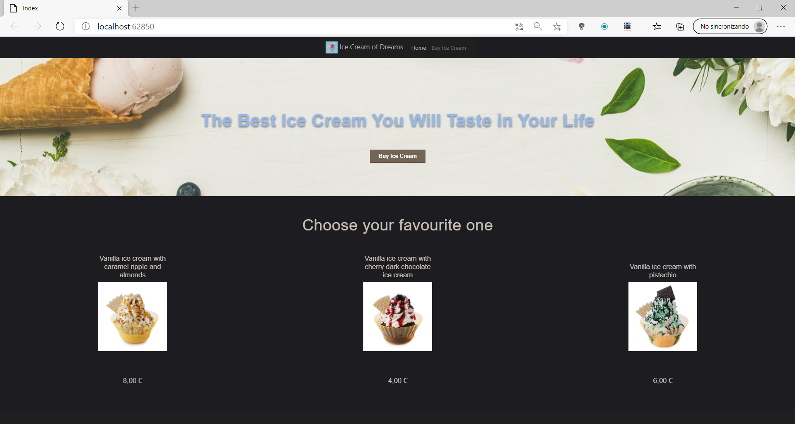
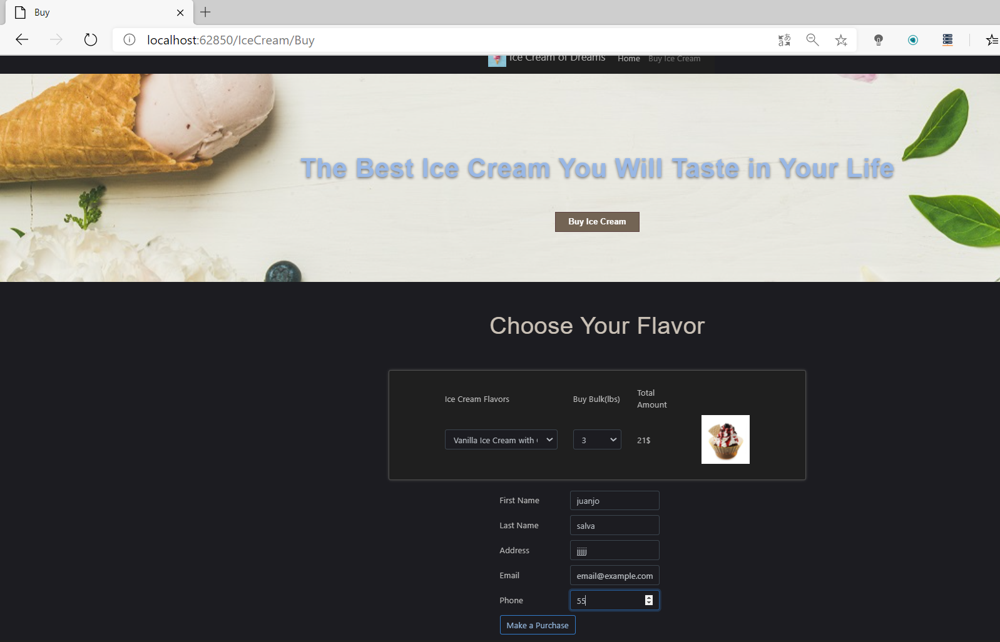
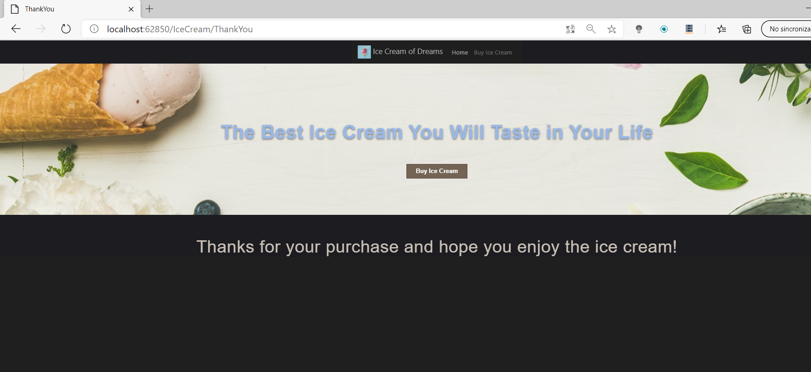

### Client-Side Development

## Laboratorio Módulo 9

Fichero de Instrucciones: Instructions\20486D_MOD09_LAK.md

Entregar el url de GitHub con la solución y un readme con las siguiente información:

1. **Nombres y apellidos:** Juan José Salvador Román
2. **Fecha:** 08/12/2020
3. **Resumen del Ejercicio:** 

Se le ha pedido que cree una aplicación de helados basada en la web para los clientes de su organización. La aplicación debe tener una página que muestre todo tipo de helados en existencia y una página de compra que permita a los clientes comprar helados. Para diseñar la aplicación, decidió usar Bootstrap y Sass. Ha decidido utilizar gulp para compilar, minificar y agrupar archivos.

Objetivos
Después de completar esta práctica de laboratorio, podrá:

- Instale gulp usando npm.

- Escribe tareas usando gulp.

- Diseñe la aplicación usando Sass y Bootstrap.

**Index**

**Comprar**

**Una vez comprado**

**Ejercicio 1:** uso de gulp para ejecutar tareas
En este ejercicio, primero instalará gulp usando npm. Luego, creará un archivo JavaScript llamado gulpfile.js. Después de eso, escribirá tareas en el archivo gulpfile.js para agrupar y minificar archivos JavaScript. Finalmente, escribirá una tarea de observador para rastrear cualquier cambio que ocurra en los archivos que se encuentran en la carpeta Scripts.

Las principales tareas de este ejercicio son las siguientes:

1. Utilice npm para instalar gulp.

2. Escriba una tarea para copiar un archivo JavaScript.

3. Ejecute la tarea.

4. Escribe una tarea para minimizar un archivo JavaScript.

5. Escriba una tarea para agrupar y minimizar todos los archivos JavaScript en una carpeta.

6. Agrega una tarea de observador.

7. Ejecute las tareas.

**Ejercicio 2:** dar estilo con Sass

En este ejercicio, primero creará un archivo Sass llamado main.scss y completará su contenido. Después de eso, creará una tarea gulp para compilar el archivo Sass en un archivo CSS. Luego, creará una tarea de seguimiento de gulp para que la compilación del archivo Sass en un archivo CSS se realice automáticamente cuando se cambie el archivo Sass.

Las principales tareas de este ejercicio son las siguientes:

1. Agrega un nuevo archivo Sass al proyecto

2. Agregue tareas de gulp para manejar los archivos Sass

3. Ejecutar una tarea

**Ejercicio 3:** uso de Bootstrap

En este ejercicio, primero actualizará la tarea min-vendor: js que agrupa y minimiza los archivos JavaScript para incluir los archivos JavaScript de Bootstrap. Después de eso, agregará una tarea para manejar los archivos CSS de Bootstrap. Luego, ejecutará las tareas para crear el archivo vendor.min.css y actualizar el archivo vendor.min.js. Después de eso, estilizará el diseño usando Bootstrap. Finalmente, creará una vista para comprar un helado y darle estilo usando Bootstrap.

Las principales tareas de este ejercicio son las siguientes:

1. Actualice gulpfile.js para manejar Bootstrap

2. Ejecuta las tareas

3. Diseñe la aplicación usando Bootstrap

4. Ejecutar la aplicación

4. **Dificultad o problemas presentados y como se resolvieron:**
