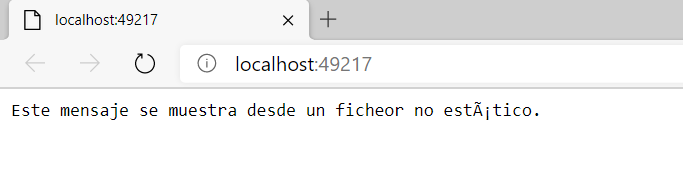
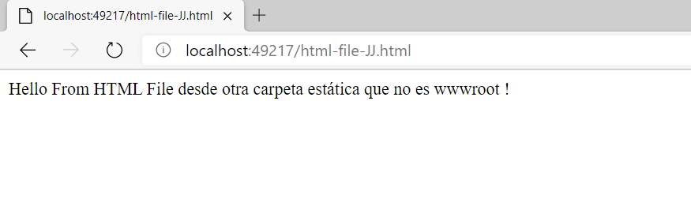

**Lesson 1_2: Configuring Middleware**
Middleware es la parte que se ocupa de enrutar y según la URL se podrá dirigir a una u otra página. Para implementar el middleeware se codifica el fichero Startup.cs

Aquí vemos el tipo de enrutamiento  Static Files que consiste en aceptar nombres de ficheros.html en la ruta. Redireccionaremos a estas páginas si así lo deseamos.
Por defecto estos ficheros html se ponen en la carpeta wwwroot. Pero también se puede crear una carpeta personalizada donde alojarlos o usar ambos.

Para usar la por defecto: wwwroot:
 app.UseStaticFiles();   

para usar una carpeta customizada:
  app.UseStaticFiles(new StaticFileOptions()
            {
                FileProvider = new PhysicalFileProvider(Path.Combine(Directory.GetCurrentDirectory(), "StaticFolderJJ"))
            });
    

para usar ambas:
app.UseStaticFiles(new StaticFileOptions()
    {
        FileProvider = new PhysicalFileProvider(Path.Combine(Directory.GetCurrentDirectory(), "StaticFolder")),
        RequestPath = "/StaticFiles/MyFolder"
    });

Primero se ejecuta el Use que pintará el mensaje: This text was generated by the app.Use middleware. Request path is: " + context.Request.Path.Value

Y acto seguido se ejecuta el Run, (y finaliza, es como un  break)  y pinta el mensaje: This text was generated by the app.Run middleware.

Como no hay enrutamiento, no dirije a ninguna página, se pintarán en la misma pantalla los 3 mensajes:

