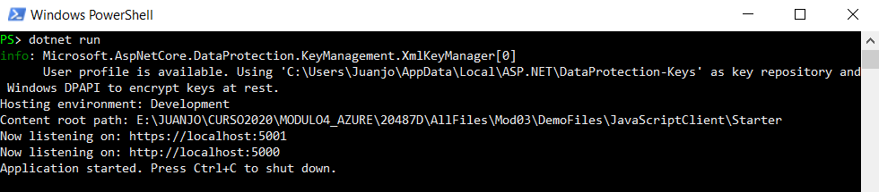
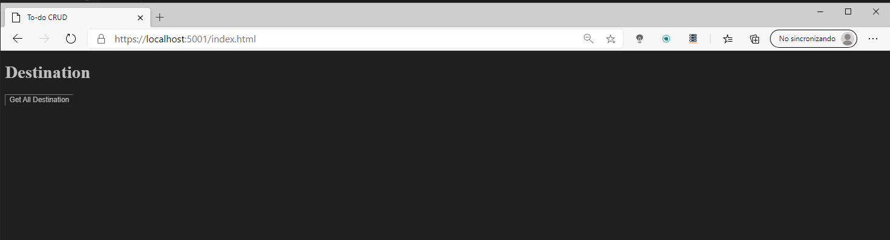
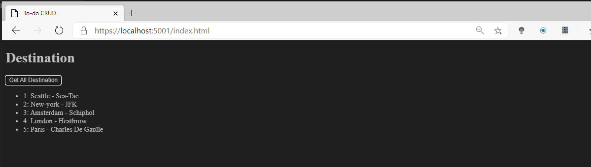
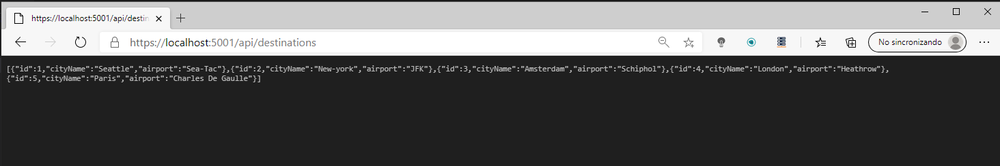
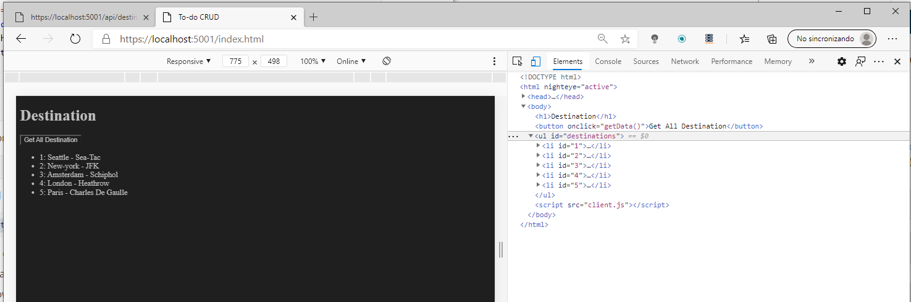

# Consuming-ASP.NET-Core-Web-APIs
DEMO3_L3

Consumimos recursos de un web appi haciendo llamadas desde javascrip, con un boton de la pagina

### Consumiendo Servicios desde Javascript

Arrancamos el servicio:

Mostramos el index

Al pulsar el botón Get All Destination se ejecuta un javascript que consume el servicio de Todos los Destinos

El Api lo que devuelve es este json

El javascript rellena una lista dinámica con los elementos de json

