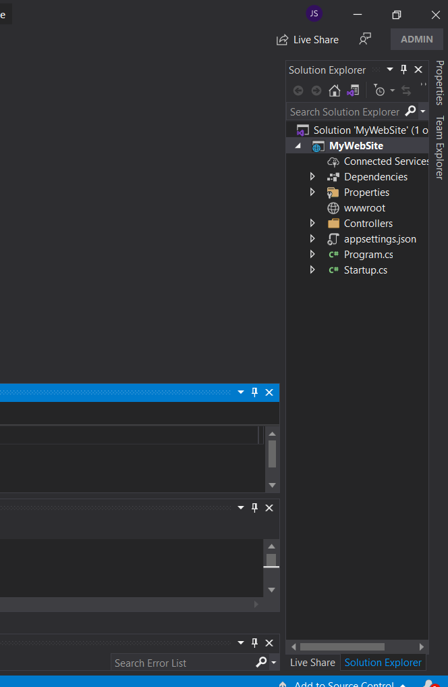
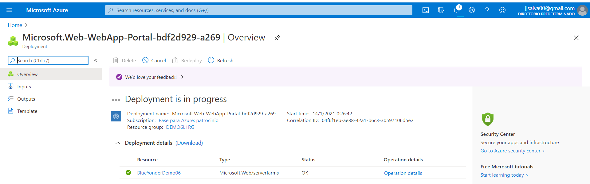
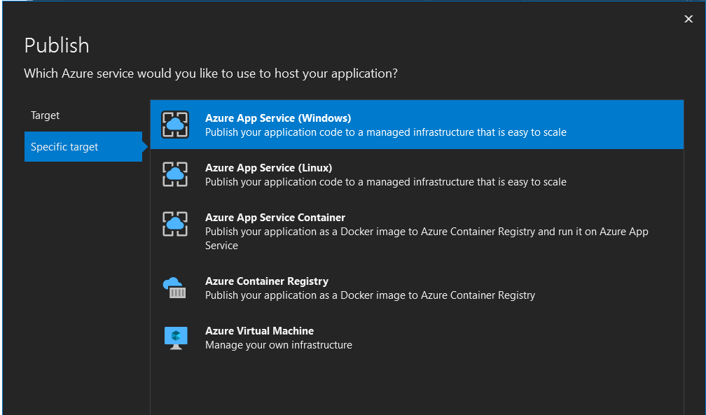
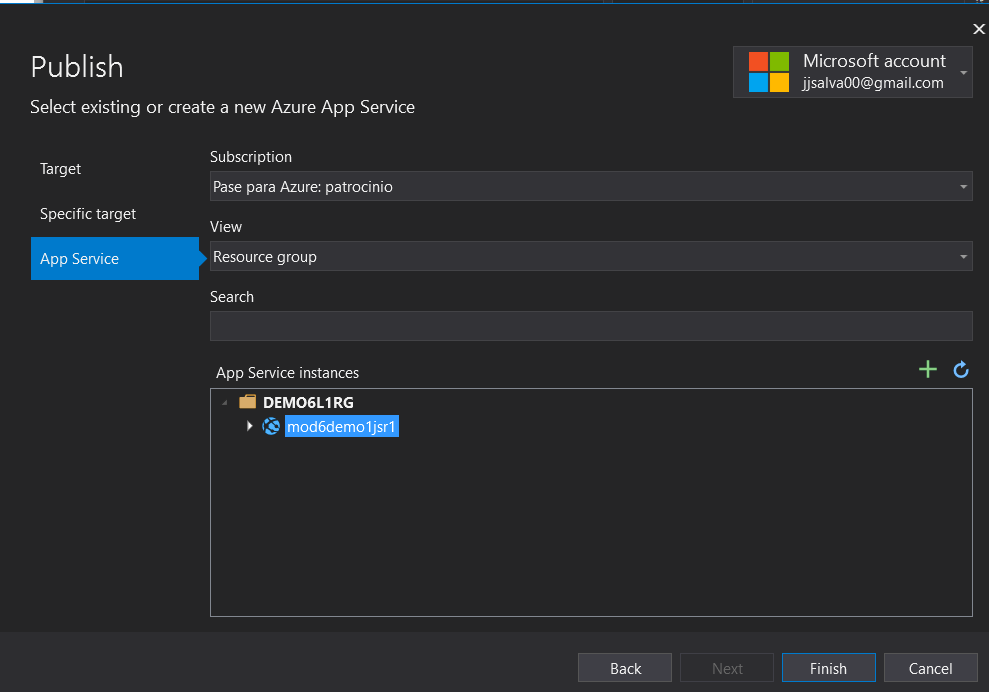
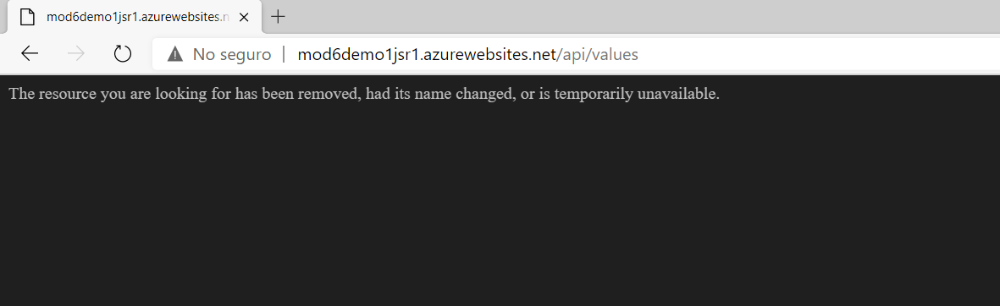

## DEMO6_L1

### Demonstration: Deploying a Web Application with Visual Studio

Creamos la solucion: una ASP.NET Core Web Application API

Abrimos Azure y creamos un App Service

Volvemos al Visual Studio y abrimos explorador de servidores y desplegamos Azure

![VSAppService]https://github.com/JuanjoSalva/Deploying-a-Web-Application-with-Visual-Studio/blob/master/img/VSAppService.PNG)

Publicamos desde Visual Studio

Publicamos el que ya existe en nuestra cuenta

Navegamos a la ruta: http://mod6demo1jsr1.azurewebsites.net/api/values

