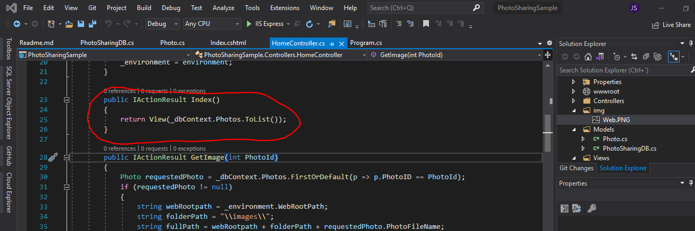
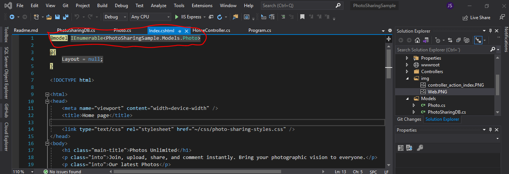
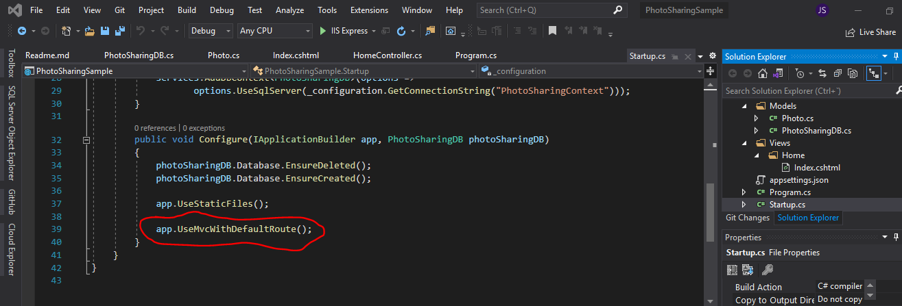
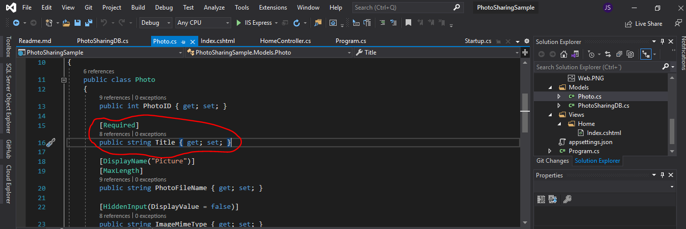
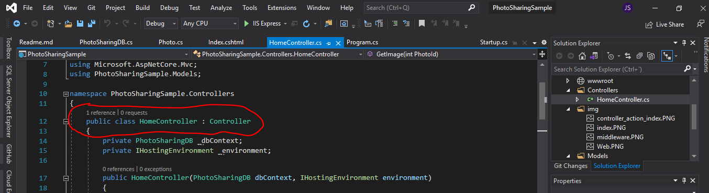
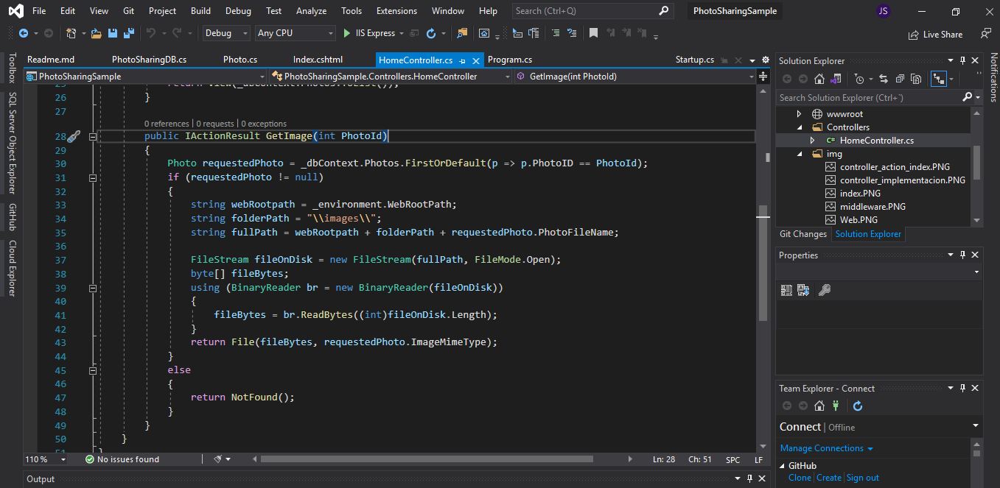
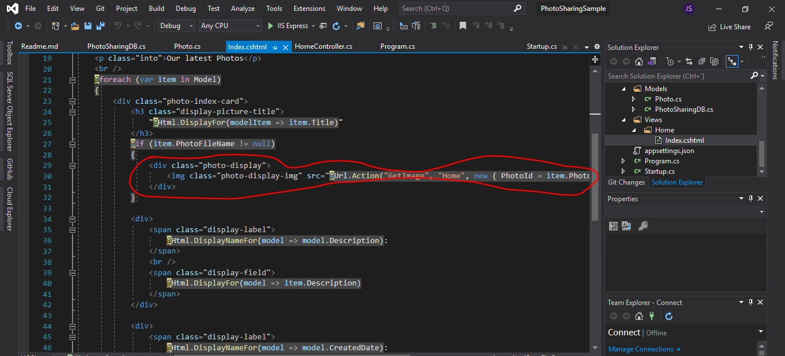

##Introduction to ASP.NET Core MVC

Es una guía para que vayamos viendo los sigueinte elementos:

Como es la web resultante:

Controlador:  accion index devuelve una lista

Index.cshtml:  ver que importamos el modelo

Startup.cd o MiddleWare: ver que estamos usando las rutras por defecto

modelo: ver la propiedad Title del modelo Photo. Además vemos que es un campo requerido con lo que si se habilita la validaciones de formulario pues se tendrá en cuenta.

home_controller:  ver como se hereda la clase base Controller 

home_controller: La acion Index

**La vista Index.cshtml**  El div que muestra las imagenes

