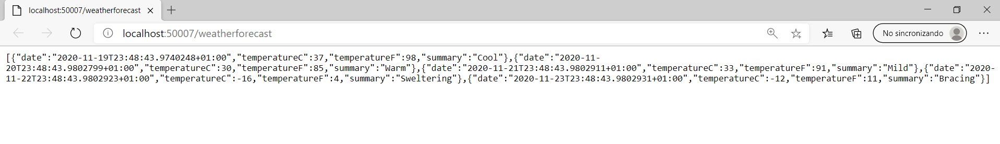
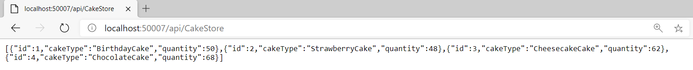
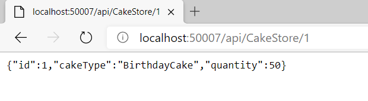

## Laboratorio Módulo 1

Fichero de Instrucciones: Instructions\20486D_MOD01_LAK.md

Entregar el url de GitHub con la solución y un readme con las siguiente información:

1. **Nombres y apellidos:** Juan José Salvadoir Román
2. **Fecha:** 27/11/2020
3. **Resumen del Ejercicio:** 

**Exploring a Web API Application**

Se desarolla una web Api que muestra listado de tartas. Maneja 2 acciones: listado del json de todas las tartas. Obtención del json del elemento cuyo id corresponde al pasado en la URL
ASP.NET Core Web Application
  Web API

4. **Dificultad o problemas presentados y como se resolvieron:**  Ninguno
