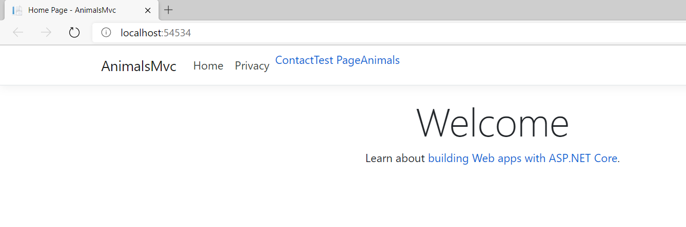
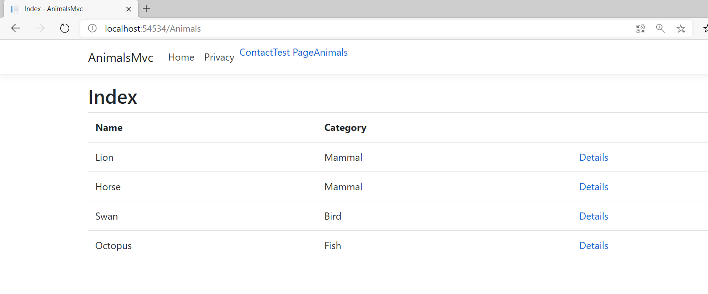
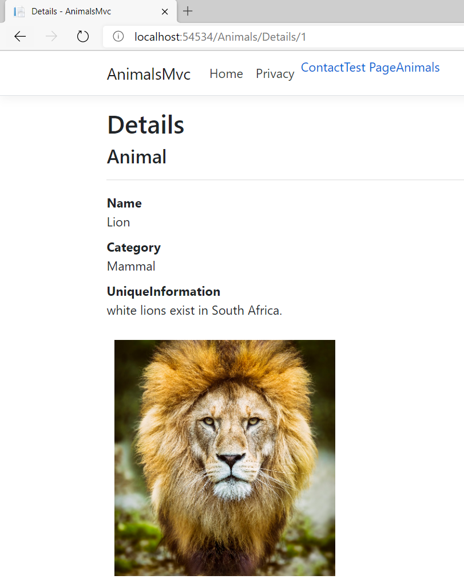

## Laboratorio Módulo 1

Fichero de Instrucciones: Instructions\20486D_MOD01_LAK.md

Entregar el url de GitHub con la solución y un readme con las siguiente información:

1. **Nombres y apellidos:** Juan José Salvador Román
2. **Fecha:** 27/11/2020
3. **Resumen del Ejercicio:** 

**Exploring an MVC Application**

Se desarolla una aplicacion web copn MVC que muestra listado de animales con un linlk al detalle que muestra la imagen del animal
ASP.NET Core Web Application
  Application (Model-View-Controller)

4. **Dificultad o problemas presentados y como se resolvieron:** Ninguno
