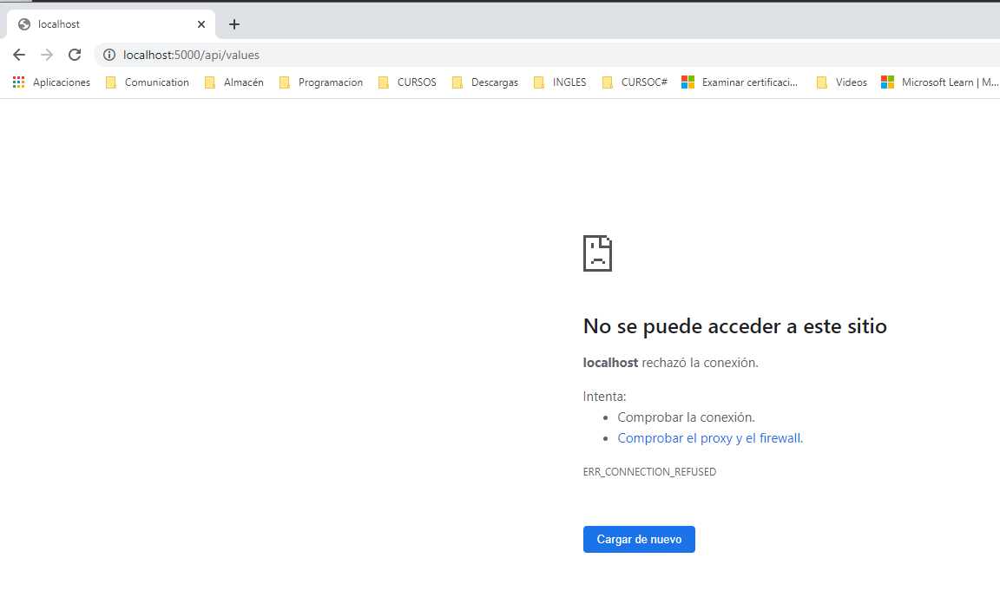
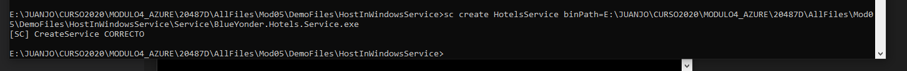
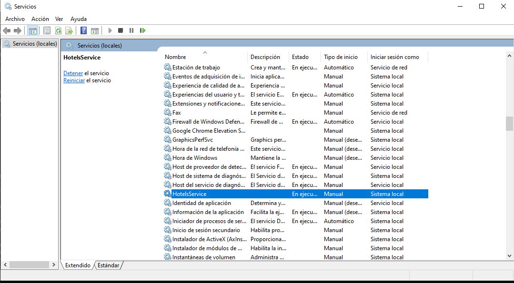
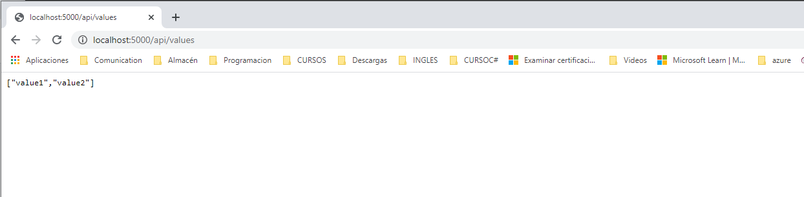
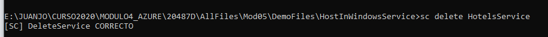

###DEMO5_L1    HOSTI N WINDOWS SERVICES

Accedemos a la web y vemos que no funciona

Para que funcione, vamos a hacer un hosting como servicio de windows.

Creo el servicio

Se ha creado el servicio

Ahora entramos en la web y vemos que si funciona

Borro el servicio

