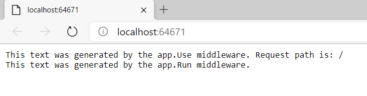

**Lesson 1: Configuring Middleware**
Middleware es la parte que se ocupa de enrutar y según la URL se podrá dirigir a una u otra página. Para implementar el middleeware se codifica el fichero Startup.cs

Aquí vemos el tipo de enrutamiento  

app.Use(async (context, next) =>
    {
        await context.Response.WriteAsync("This text was generated by the app.Use middleware. Request path is: " + context.Request.Path.Value + "\n");
        await next.Invoke();
    });
    
app.Run(async (context) =>
    {
        await context.Response.WriteAsync("This text was generated by the app.Run middleware.");
    });
    

Primero se ejecuta el Use que pintará el mensaje: This text was generated by the app.Use middleware. Request path is: " + context.Request.Path.Value

Y acto seguido se ejecuta el Run, (y finaliza, es como un  break)  y pinta el mensaje: This text was generated by the app.Run middleware.

Como no hay enrutamiento, no dirije a ninguna página, se pintarán en la misma pantalla los 3 mensajes:

