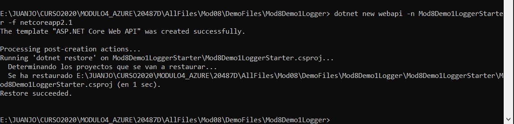
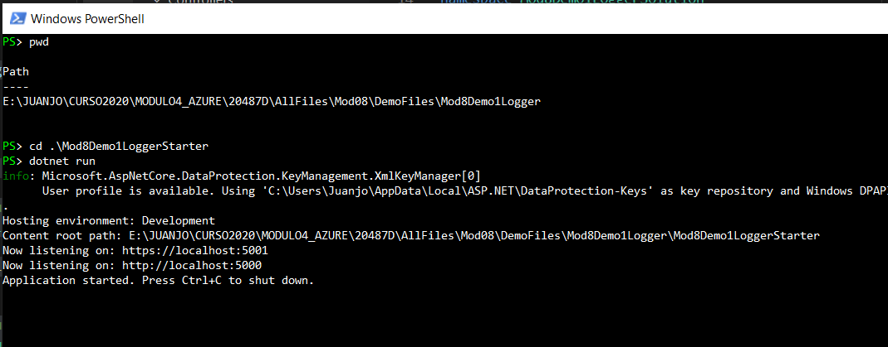
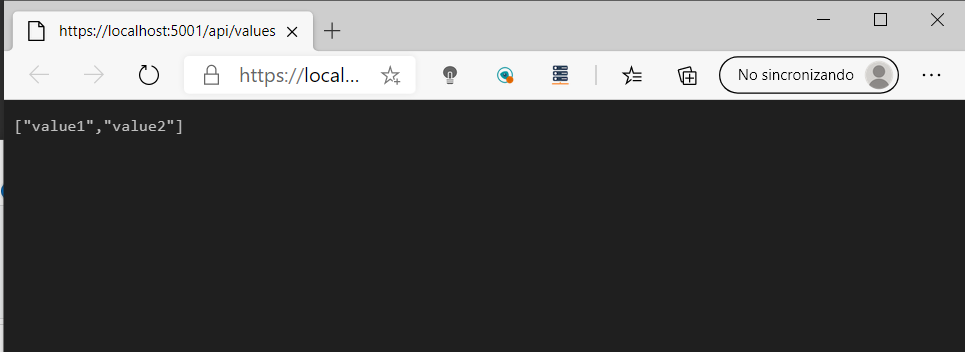
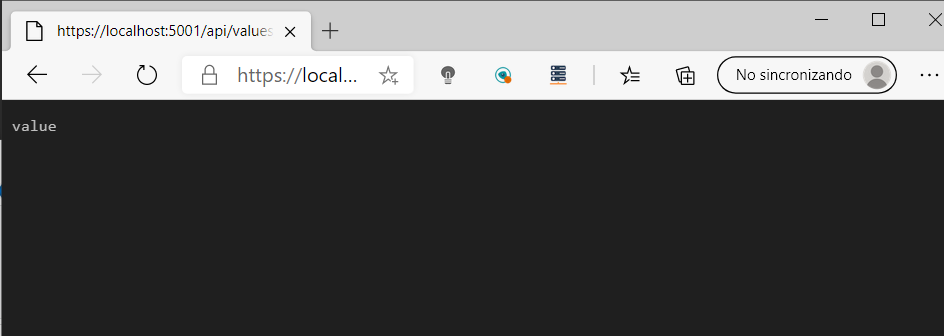
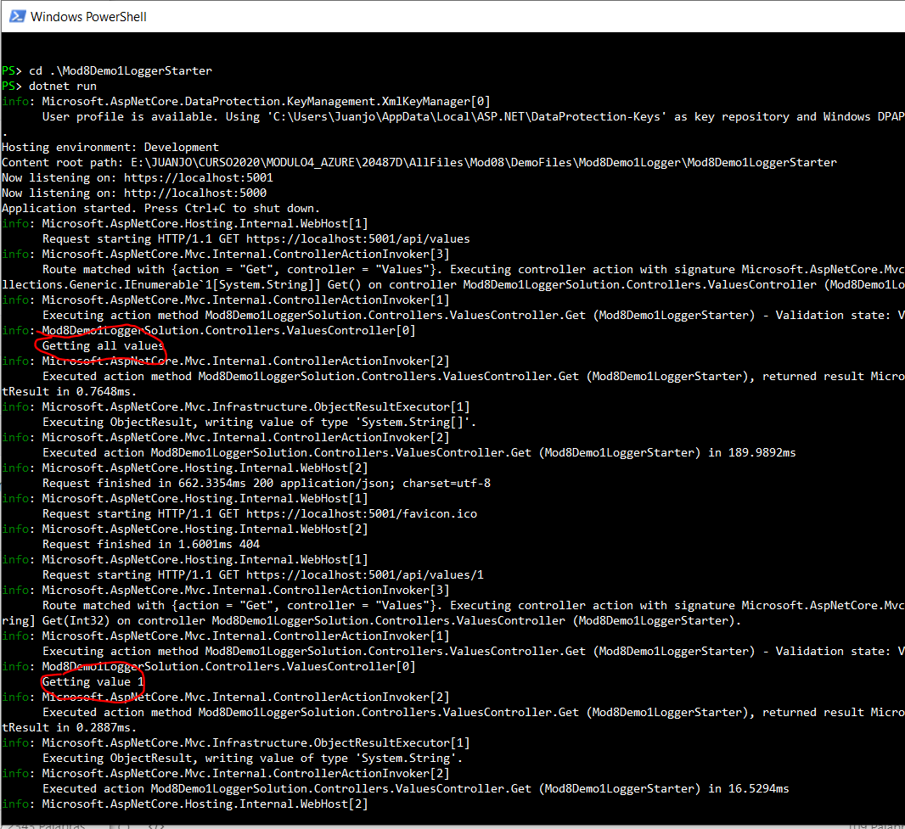

## MOD8_L1_1

### Demonstration: Recording logs to the Console and EventSource providers

Se crea el WebApi por codigo:

dotnet new webapi -n Mod8Demo1LoggerStarter -f netcoreapp2.1  

Se cambia código y se ejecuta

Entramos en la url para ver el GetAll:

https://localhost:5001/api/values

Entramos en la url para ver un valor:

https://localhost:5001/api/values/1

Vemos los logg

