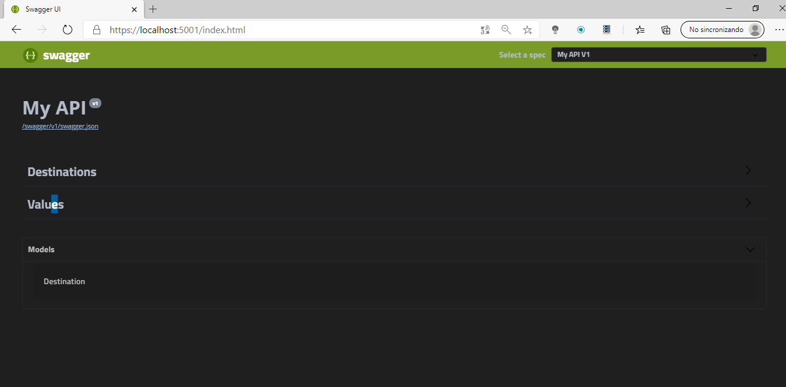
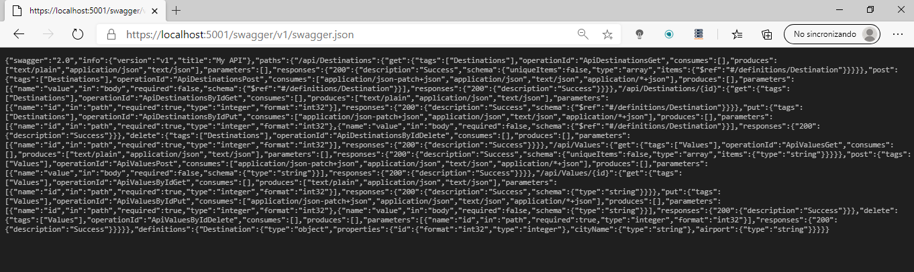
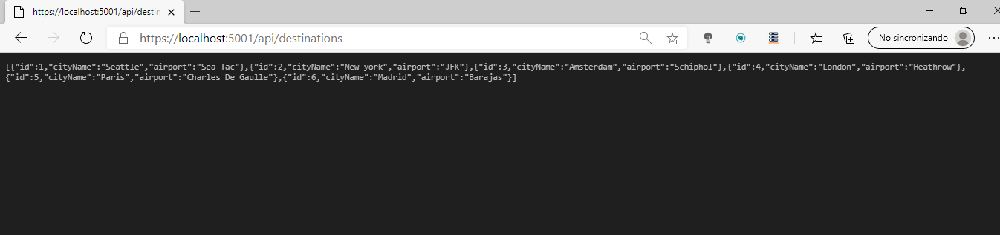

DEMO3_L3_4

En nuestra API web Vamos a crear un recurso que implemente el swagger en un punto de la url, de esta manera cuando naveguemos a esta url nos mostrará los recursos de nuestra API Web.

El Swagger muestra lso controladores de nuestra API Web:

Y los recursos de cada uno

También lo podemos conseguir en json:

Y el recurso get nos devuelve esta información:

