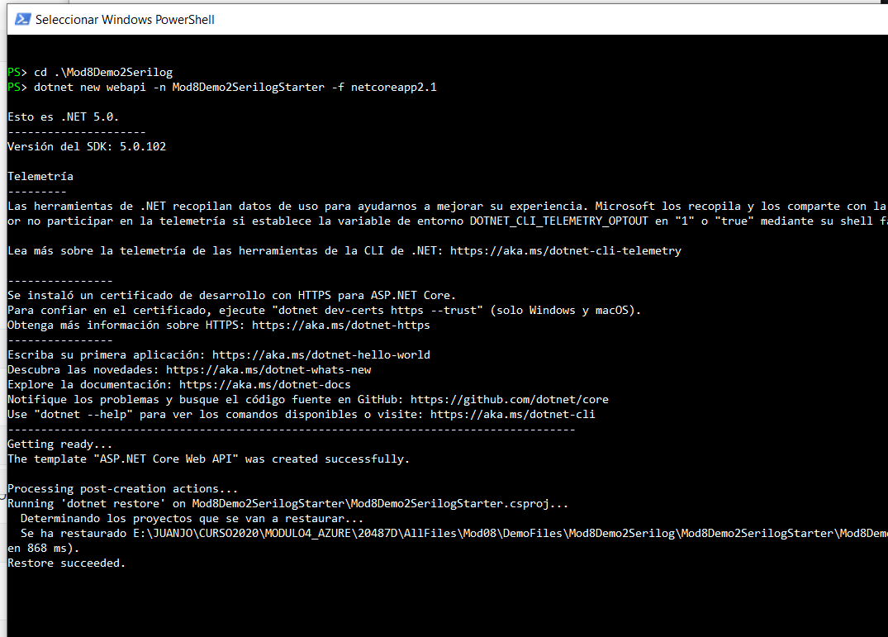
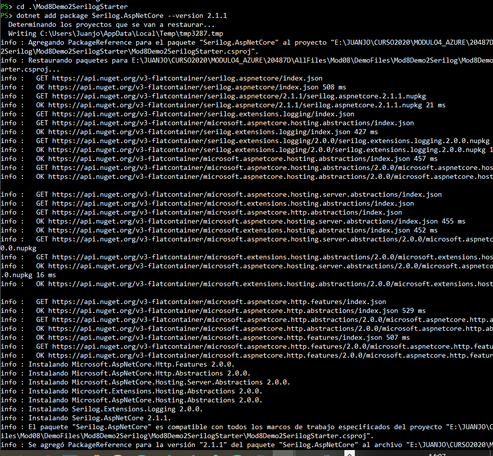
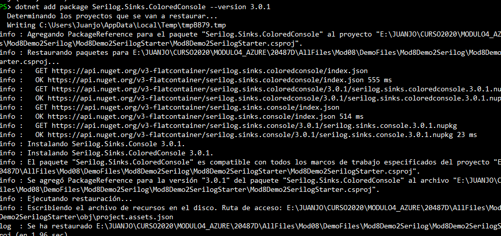
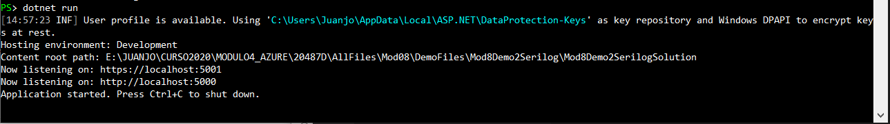
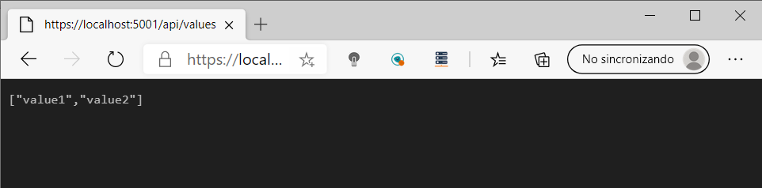

## DEMO8_L1_2

### Using Serilog

Creamos una webapi

dotnet new webapi -n Mod8Demo2SerilogStarter -f netcoreapp2.1   

Añadimos paquete Serilog.AspNetCore

dotnet add package Serilog.AspNetCore --version 2.1.1

añadimos paquete Serilog Colored Console

dotnet add package Serilog.Sinks.ColoredConsole --version 3.0.1

añadimos code al Program.cs

using Serilog;

​	

.UseSerilog((hostingContext, loggerConfiguration) => loggerConfiguration
    .ReadFrom.Configuration(hostingContext.Configuration)
    .Enrich.FromLogContext()
    .WriteTo.Console());

Ejecutamos

Mostramos la web

