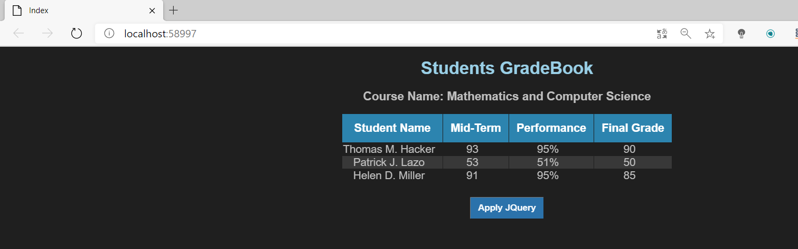

###Using jQuery

En esta práctica añadimos JQuery, añadiendo un fichero javascript en la carpeta JS destro de wwwroot.

Lo que haremos es recorrer elementos de una tabla y a cada uno le añadiremos una clase diferente para que cambie el formato segun el estilo de cada clase asociada

Antes de ejecutar el jquery:

Después de ejecutar el jquery:

