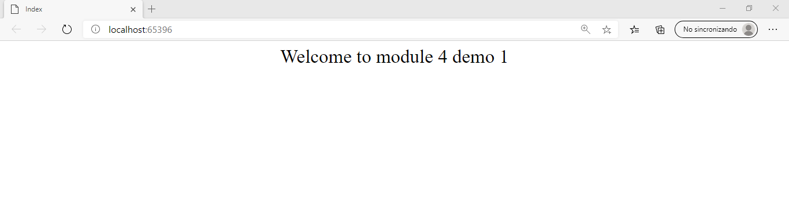
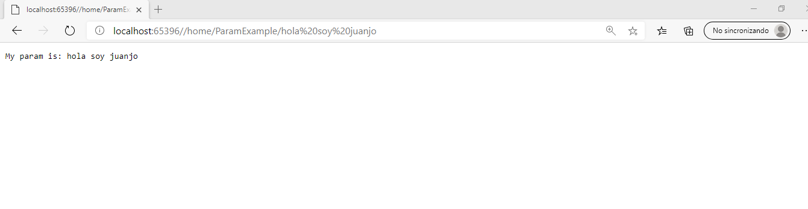
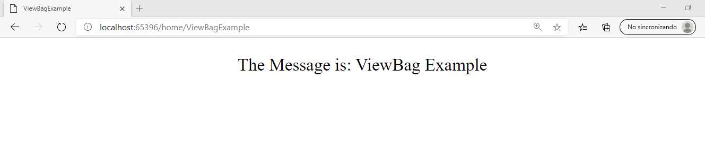
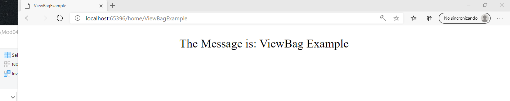

Aquí estamos probando acciones de un controlador y como pasar parámetros a la vista:
Content (que no es pasar parámetro pero se puede pimntar variables que haya en propia la url).
ViewBag, ViewData (estos sí guardan un valor en el controlador y lo envían a la vist).

1- Le creamos un controlador con la acción index
            ExampleModel model = new ExampleModel() 
             { 
                Sentence = "Welcome to module 4 demo 1" 
             };
            return View(model);
            
            Abrimos la aplicación: http://localhost:[port]
            Deberá pintar: Welcome to module 4 demo 1

2- Creamos otra acción al controlador, la ParamExample.           
            public IActionResult ParamExample(string id)
            {
                return Content("My param is: " + id);
            }

            Abrimos la aplicación: http://localhost:[port]/home/ParamExample/Hola soy Juanjo
            Deberá pintar el parametro pasado: Hola soy Juanjo

3- Creamos otra acción al controlador, la ViewBagParam.
             public IActionResult ViewBagExample()
            {
                ViewBag.Message = "ViewBag Example";
                return View();
            }

            Abrimos la aplicación: http://localhost:[port]/home/ViewBagExample
            Deberá pintar el valor de  ViewBag:Message que es = "ViewBag Example"

4- Creamos otra acción al controlador, la ViewSataExample.
              public IActionResult ViewDataExample()
                {
                    ViewData["Message"] = "ViewData Example";
                    return View();
                }

            Abrimos la aplicación: http://localhost:[port]/home/ViewBagExample
            Deberá pintar el valor de  ViewBag:Message que es = "ViewBag Example" 

 
